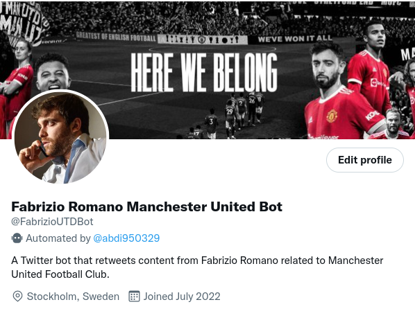

# Twitter-Bot-Manchester-United

[](https://pypi.org/project/tweepy/)
[](https://pypi.org/project/tweepy/)
[](https://developer.twitter.com/en/docs/twitter-api)



## Table of contents
* [General info](#general-info)
* [Technologies](#technologies)
* [Setup](#setup)

## General info
A Twitter bot that retweets content from Fabrizio Romano related to Manchester United Football Club.
	
## Technologies
Project is created with:
* Python-3.8
* Twitter API V2
* Google Cloud Platform (either Google Function or in my case Google Cloud VM).
	
## Setup
To run this project, install it locally:

```
$ sudo apt update
$ sudo apt install python3-pip
$ pip3 install tweepy
$ python3 main.py

```
Links
-----

- [Documentation](https://tweepy.readthedocs.io/en/latest/)
- [Google Cloud Platform](https://cloud.google.com/)
- [Twitter API Documentation](https://developer.twitter.com/en/docs/twitter-api)
